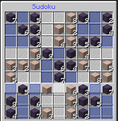
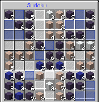
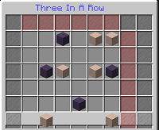
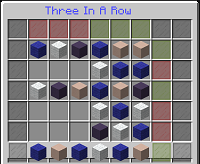
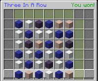

# Logic puzzles for GameBox

This is a minecraft plugin written with the Bukkti API. It adds logic puzzles as inventory games to the plugin [GameBox](https://www.spigotmc.org/resources/37273/).

## Games
- [Sudoku](src/main/java/me/nikl/logicpuzzles/sudoku)
- [Three in a row](src/main/java/me/nikl/logicpuzzles/threeinarow)

### Sudoku

Rules:
1. All 9 3x3 grids have to contain every number from 1 to 9
2. All rows and columns have to contain every number from 1 to 9

The game starts with some unchangeable numbers. Left click adds one to the current value, while right click decreases it by one.

### ThreeInARow

Rules:
1. Every row and every column has to contain 3 blocks of each color (default: blue and white)
2. There can never be more then 2 blocks with the same color next to each other (vertically and horizontally)

The game starts with some unchangeable blocks. By clicking the slots you can go through the possible colors.

